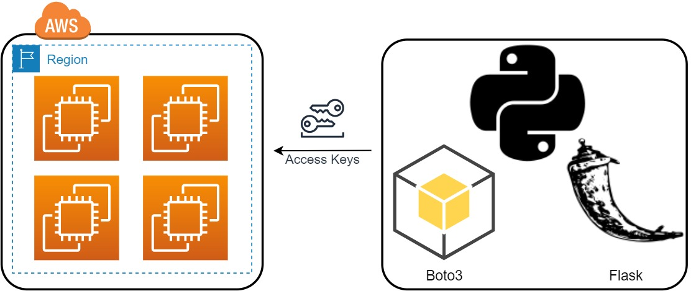

# Python Boto3 API



### Python API uses Flask and Boto3 libraries. It has the features of Instance listing, Instance start and Instance stop; it has 3 endpoints communicate with EC2 service on AWS.

---

## Create Instance

You send a POST request to the `create` endpoint with the following parameters and it will create an instance with the given parameters.

```
http://<api_host>:<api_port>/ec2/create
```

| Parameter               | Type     | Description           |
| :---------------------- | :------- | :-------------------- |
| `aws_access_key_id`     | `string` | AWS Access Key ID     |
| `aws_secret_access_key` | `string` | AWS Secret Access Key |
| `region_name`           | `string` | AWS Region Name       |
| `KeyName`               | `string` | AWS Key Name          |
| `SecurityGroupId`       | `string` | AWS Security Group ID |

---

## List Instances

You send a request to this endpoint by entering the following parameters, and you can list all the instances in your AWS account in the region you specify and their status.

```
http://<api_host>:<api_port>/ec2/list
```

| Parameter               | Type     | Description           |
| :---------------------- | :------- | :-------------------- |
| `aws_access_key_id`     | `string` | AWS Access Key ID     |
| `aws_secret_access_key` | `string` | AWS Secret Access Key |
| `region_name`           | `string` | AWS Region Name       |

---

## Start Instance

You send a request to this endpoint by entering the following parameters, and you can start the instance you specified with `instance_id`, in the region you specified with `region_name` and the status of the instance will be changed to `pending` and then to `running`.

```
http://<api_host>:<api_port>/ec2/start
```

| Parameter               | Type     | Description           |
| :---------------------- | :------- | :-------------------- |
| `aws_access_key_id`     | `string` | AWS Access Key ID     |
| `aws_secret_access_key` | `string` | AWS Secret Access Key |
| `region_name`           | `string` | AWS Region Name       |
| `instance_id`           | `string` | Instance ID Number    |

---

## Stop Instance

You send a request to this endpoint by entering the following parameters, and you can stop the instance you specified with `instance_id`, in the region you specified with `region_name` and the status of the instance will be changed to `stopping` and then to `stopped`.

```
http://<api_host>:<api_port>/ec2/stop
```

| Parameter               | Type     | Description           |
| :---------------------- | :------- | :-------------------- |
| `aws_access_key_id`     | `string` | AWS Access Key ID     |
| `aws_secret_access_key` | `string` | AWS Secret Access Key |
| `region_name`           | `string` | AWS Region Name       |
| `instance_id`           | `string` | Instance ID Number    |

---

## Terminate Instance

You send a request to this endpoint by entering the following parameters, and you can terminate the instance you specified with `instance_id`, in the region you specified with `region_name` and the status of the instance will be changed to `shutting-down` and then `terminated`.

```
http://<api_host>:<api_port>/ec2/terminate
```

| Parameter               | Type     | Description           |
| :---------------------- | :------- | :-------------------- |
| `aws_access_key_id`     | `string` | AWS Access Key ID     |
| `aws_secret_access_key` | `string` | AWS Secret Access Key |
| `region_name`           | `string` | AWS Region Name       |
| `instance_id`           | `string` | Instance ID Number    |
